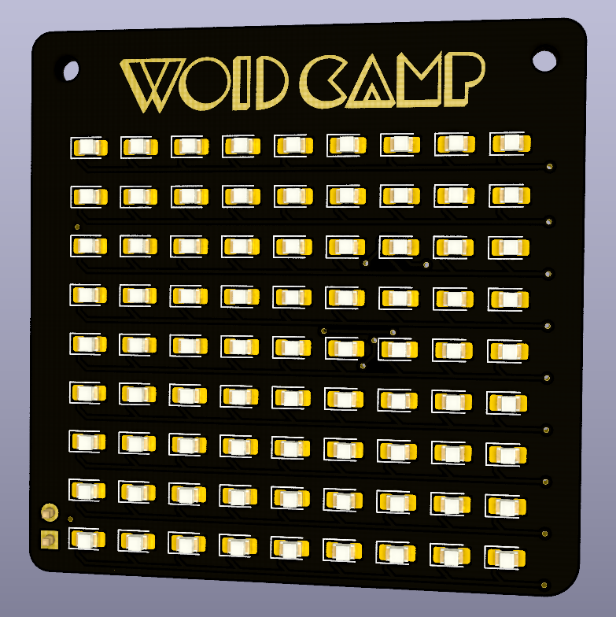
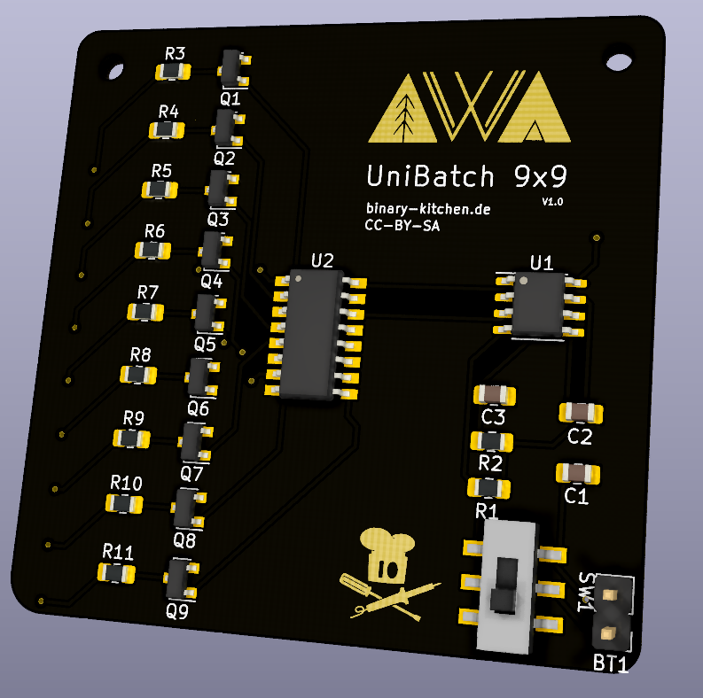

# UniBadge 9x9
A simple Badge PCP with 9x9 LEDs. Create symbols, figures, pixel art by just soldering LEDs to the spots you want. No programming needed.

 

## Bill of Material
| Designator | Package            | Quantity | Designation                    |
| ---------- | ------------------ | -------- | ------------------------------ |
| BT1        | 2-Pin Connector    | 1        | Battery-Holder (2x AAA)        |
| C1, C2     | 100n F             | 2        |                                |
| C3         | 0805 SMD Capacitor | 1        | variable (see capaictor table) |
| D1-D81     | 0805 SMD LED       | 1-81     | LED Red                        |
| Q1-Q9      | Mosfet             | 9        | 2N7002                         |
| R1, R2     | 0805 SMD Resistor  | 2        | 100k Ohm                       |
| R3-R11     | 0805 SMD Resistor  | 9        | variable (see resistor table)  |
| SW1        | SMD Switch         | 1        |                                |
| U1         | SOIC-8 NE555       | 1        |                                |
| U2         | SOP-16 CD4017      | 1        |                                |

### Capacitor-Table for C3
The frequency can be set by different capacitors for C3. Always on: The frequency is so fast, it looks like all (soldered) LEDs are always on.

| Frequency | Capacitor Value (C3) \[F\] |
| --------- | -------------------------- |
| slow      | 1µ F                       |
| always on | 10n F                      | 

### Resistor-Table for R3-R11
Depending on the amount of soldered LEDs per row and depending on the color of the row, you need different resistor sizes (see table below). Carefull: You can only chose one LED-Color per row!

| \# LEDs | Resistor Value (R3-R11) \[Ohm\] | LED-Color |
| ------- | ------------------------------- | --------- |
| 1       | 27                              | red       |
| 2       | 13                              | red       |
| 3       | 9,1                             | red       |
| 4       | 6,8                             | red       |
| 5       | 5,1                             | red       |
| 6       | 4,3                             | red       |
| 7       | 3,9                             | red       |
| 8       | 3,3                             | red       |
| 9       | 3                               | red       |

## Manual
TBD

## Copyright and Authorship
- PCB-Layout: [CC-BY-SA 4.0](https://creativecommons.org/licenses/by-sa/4.0/) - [Thomas Schmid and Timo Schindler](https://www.binary-kitchen.de)
- Manual (TeX): [LPPL](https://www.latex-project.org/lppl.txt) - [Marei Peischl](https://peitex.de)
- Manual (pdf): [CC-BY-SA 4.0](https://creativecommons.org/licenses/by-sa/4.0/) - [Binary Kitchen e.V.](https://www.binary-kitchen.de)

## Acknowledgments
A big thank you goes to Thomas Schmid, Clemens Grünewald and Sandra Schweighart for all the help!

Frequency-calculation done with https://ohmslawcalculator.com/555-astable-calculator

## Misc: Logo to PCB
The Logos to the PCB are created with an Inkscape plugin

- download and install https://github.com/badgeek/svg2shenzhen
- Inkscape: Extensions -> svg2shenzhen -> Prepare Document
- Choose Layer where to place the logo
- Rename: remove "disabled" from layer-name
- Place logo
- Extensions -> svg2shenshen -> Export Kicad (Kicad-module)
- Copy .kicad_mod in .pretty-folder
- Place as Part